# 🥗 Personalized Healthy Recipe Chatbot


An intelligent AI-powered chatbot that provides personalized diet plans and recipe suggestions based on individual health profiles, dietary restrictions, and diseases. It integrates **machine learning**, **natural language processing**, and **nutrition science** to ensure healthy and personalized meal guidance.

---

## 📌 Features

- 🧠 **AI-Powered Chat Interface** – Natural conversation to request recipes or health-based meal suggestions
- 🧬 **Personalized Diet Planning** – Calculates daily calorie, protein, and carbohydrate needs based on:
  - Age, Gender, Height, Weight
  - Activity level
  - Dietary goals (gain/lose/maintain)
  - Health conditions (e.g., diabetes, hypertension, etc.)
- 🩺 **Disease-aware Filtering** – Filters out ingredients harmful for conditions like:
  - Diabetes
  - Liver cirrhosis
  - Hypertension
  - Kidney disease
- 📅 **Weekly Meal Plan Generator** – ML-based meal planner balancing calories and macros
- 🔍 **Recipe Search with Details** – Ingredients, nutrients, and preparation steps
- 🧠 **Semantic Search & Matching** – Using Sentence Transformers & RapidFuzz for accurate input handling
- 🧠 **Contextual Chat History** – Saved via Pinecone vector DB for personalized memory

---

## 🛠️ Tech Stack

| Layer        | Tools/Libs Used                                                  |
|--------------|------------------------------------------------------------------|
| 🧠 AI/NLP     | OpenAI Gemini API / Sentence Transformers / RapidFuzz           |
| 🧪 ML Models | Scikit-learn (RandomForestRegressor)                             |
| 🧮 Data       | Processed CSV datasets from USDA and medical nutrition sources  |
| 🌐 Backend    | Python, Flask                                                    |
| 💬 Frontend   | HTML, CSS, JavaScript                                            |
| 🧠 Vector DB  | Pinecone                                                         |

---

## 🗂️ Project Structure

```bash
RecipeChatbot/
├── static/                   # CSS, JS files
├── templates/                # HTML templates
├── weekly_meal_plan.csv      # Generated weekly plan
├── dataset.csv               # Nutrition + Disease-aware recipe dataset
├── routes.py                 # Flask routes
├── recipe_utils.py           # Chat logic, ML models
├── script.js                 # Frontend logic
├── .gitignore
├── requirements.txt
└── README.md
```

## 🚀 How to Run Locally

1. **Clone the repository**
```bash

git clone https://github.com/k-manisha9/healthy-recipe-chatbot.git
cd healthy-recipe-chatbot

```
2. **Set up a virtual environment**
```bash

python -m venv venv
venv\Scripts\activate     # On Windows
source venv/bin/activate  # On Mac/Linux
```

3. **Install dependencies**
```bash
bash
Copy
Edit
pip install -r requirements.txt
```
4. **Run the app**
```bash
bash
Copy
Edit
python routes.py
```

## 🧪 Sample Inputs
```bash

“Suggest meals for a diabetic person aged 45 who wants to lose weight.”
“Plan a weekly meal for a person with kidney disease and high blood pressure.”
“What can I eat if I’m allergic to nuts and want high protein?”
```


## 📷 Screenshots
### 🧠 Chatbot Conversation  
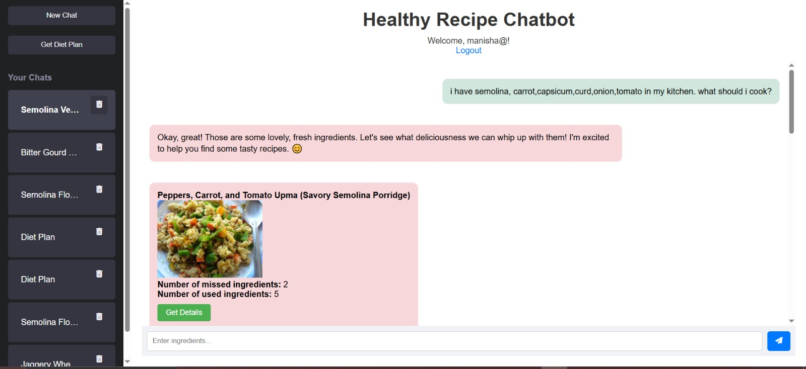
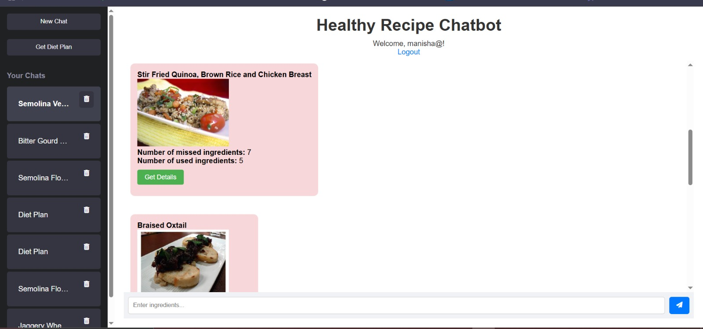
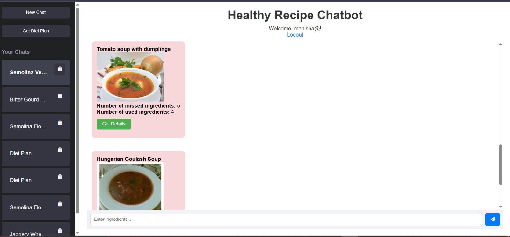
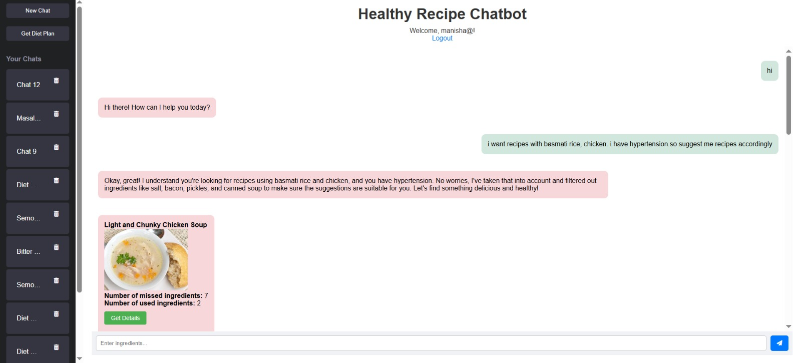
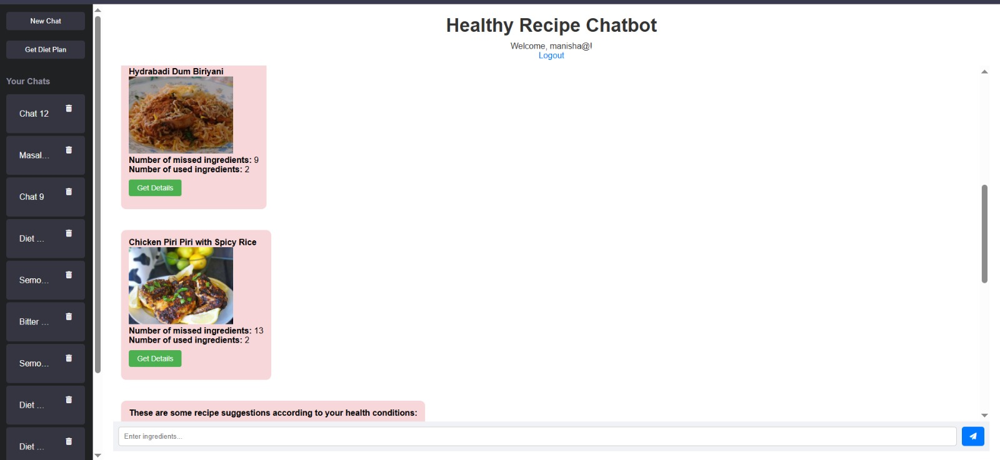
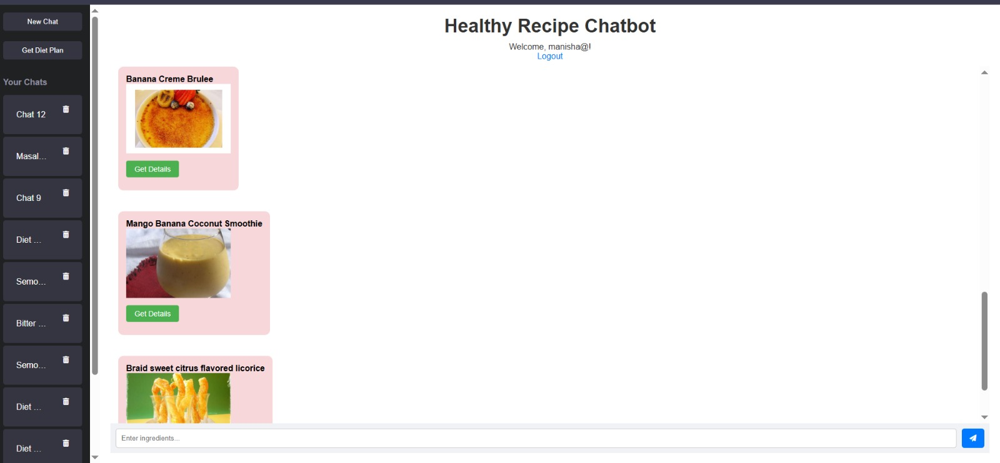
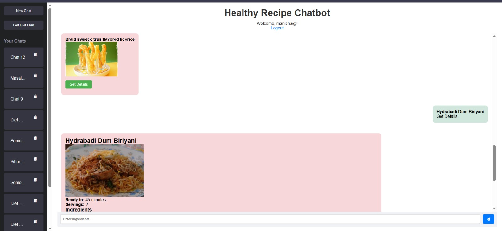
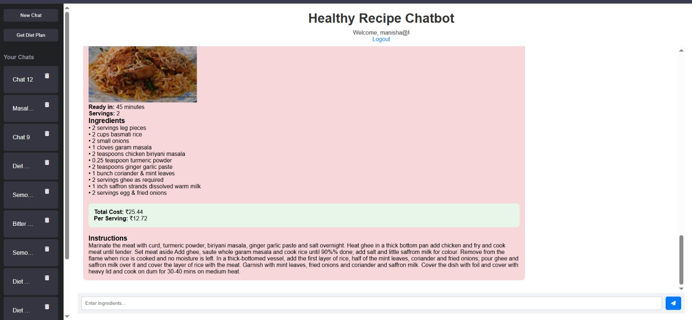
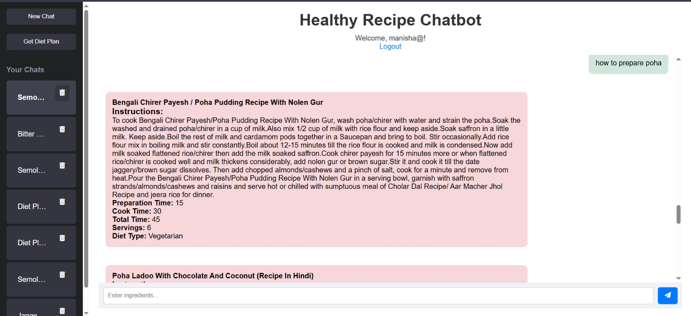
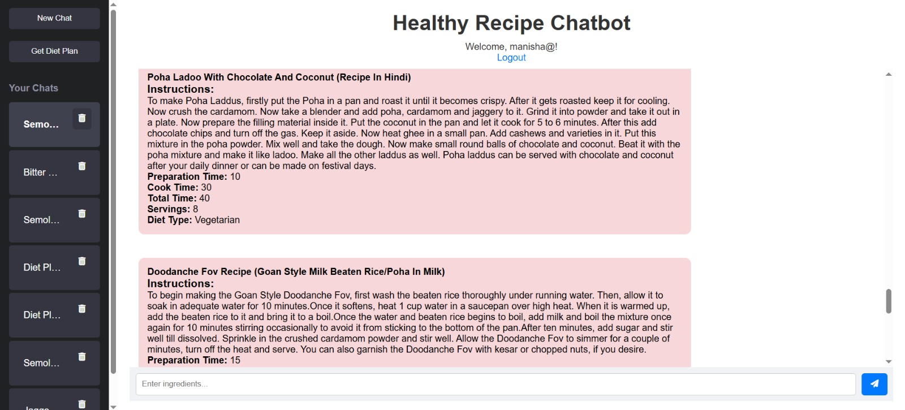
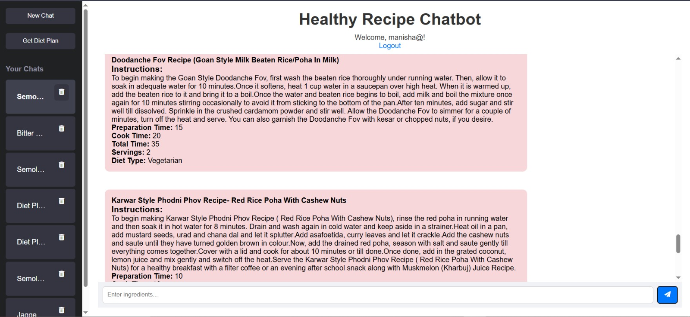
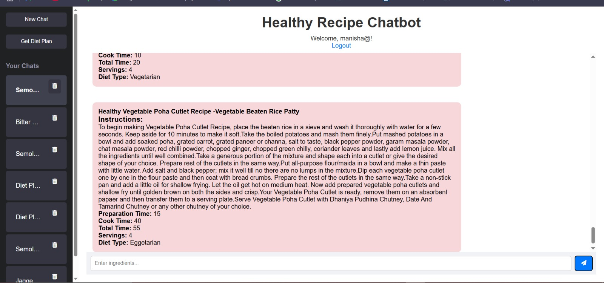
### 🍽️ Generated Meal Plan  
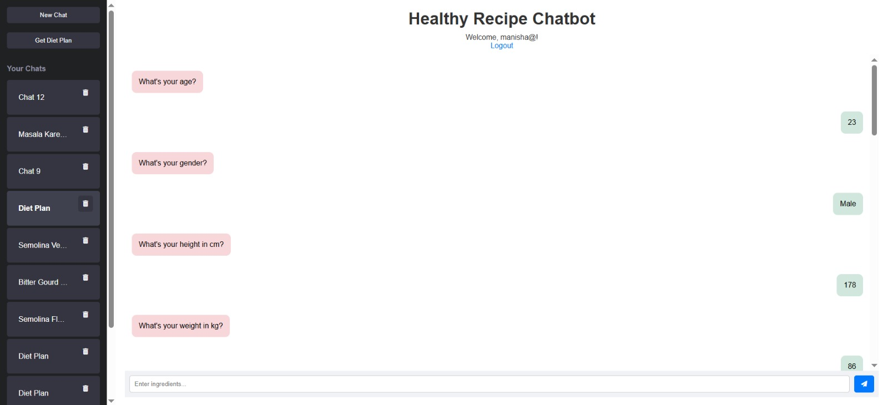
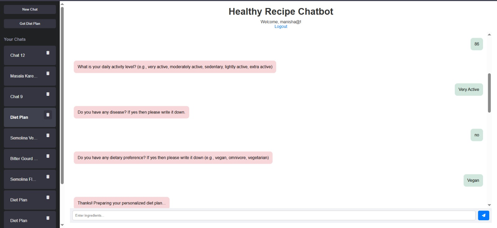
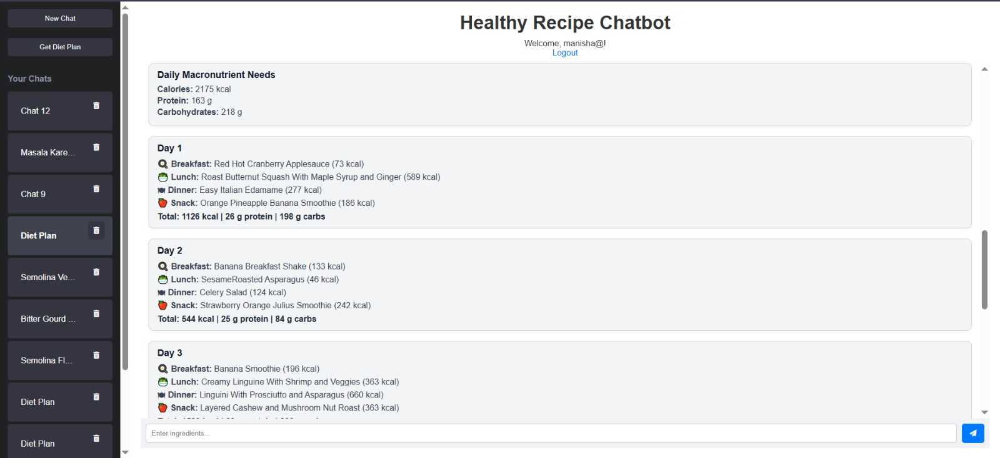
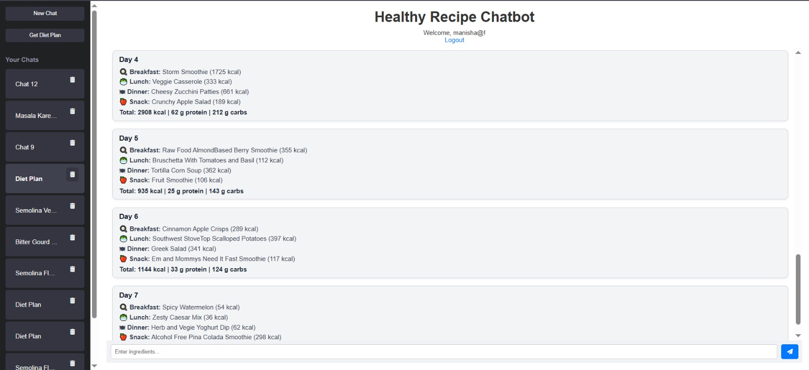


## 📦 Future Improvements
- 🗣️ Add voice assistant functionality
- 📲 Mobile responsiveness
- 🧑‍⚕️ Doctor/Nutritionist review loop
- 📊 Daily nutrient tracking dashboard
